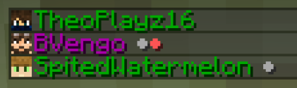

# Stream Status
This is a basic minecraft datapack, allowing players to indicate if they are recording or not. It also updates based on if a player is AFK or not. As another feature, it displays coloured names based on which dimension the player is in.

| Status    | Colour    |
|-----------|-----------|
| Overworld | Green     |
| Nether    | Red       |
| End       | Purple    |

The following image is a few images of the status / AFK combinations.

**Please note that this datapack uses teams to allocate name colours and prefixes. If you wish to use other teams, you will need to temporarily remove this datapack since minecraft currently only allows one team per player.**

## Installation / Removal
To install the datapack, simply drag the downloaded zip file into the datapack folder of your world.
To uninstall, type /function stream_status_uninstall. This will remove all teams, scoreboard values, and tags related to the datapack. Then remove the zip file from the datapacks folder and reload the world.